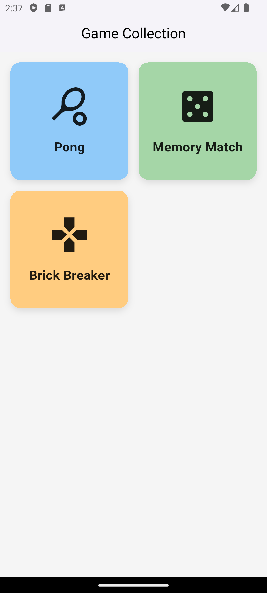
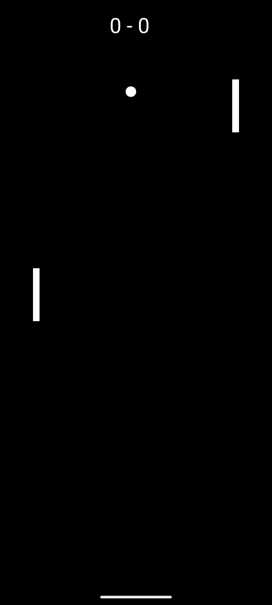
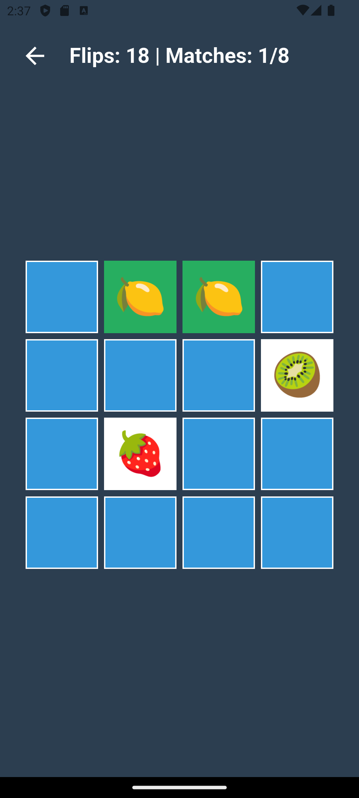
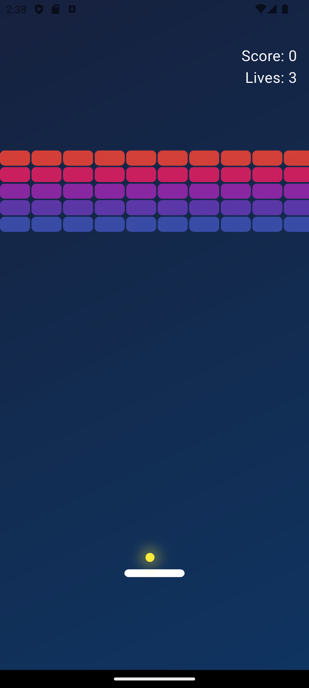

# Flutter Mini Games Collection

A collection of three classic mini-games built with **Flutter** + **Flame** (and one pure CustomPainter implementation).

## 🎮 Games Included

| Game            | Engine              | Input style          | Features                                 |
|-----------------|---------------------|----------------------|------------------------------------------|
| **Pong**        | Flame               | Touch drag (left side) | AI opponent, score to 3, game-over overlay |
| **Memory Match**| Flame               | Tap cards            | 4×4 grid, flip & match, win animation    |
| **Brick Breaker**| CustomPainter + Ticker | Horizontal drag + tap to launch | Particles, lives system, score, win/lose |

## 📸 Screenshots

  
  
  
  

### Prerequisites

- Flutter 3.10+  
- Dart 3.0+
